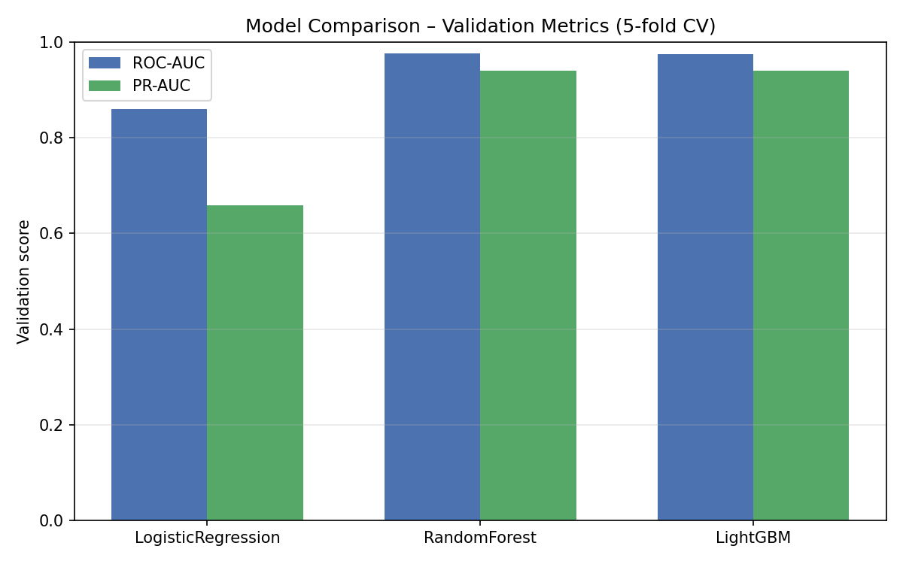

# Model Comparison Report – Same Data & Validation Scheme

All models trained/evaluated with identical preprocessing, leakage control and 5-fold stratified CV (see `assess_overfitting.py`).

| Metric | Logistic Reg. | Random Forest | **LightGBM (final)** |
|--------|--------------:|--------------:|--------------------:|
| ROC-AUC (val) | 0.859 ± 0.009 | **0.976 ± 0.001** | 0.976 ± 0.001 |
| PR-AUC (val)  | 0.659 ± 0.025 | 0.940 ± 0.004 | **0.941 ± 0.005** |
| ROC gap (train-val) | 0.023 | 0.022 | 0.024 |
| PR gap (train-val)  | 0.052 | 0.056 | 0.059 |
| Model size (≈MB) | 0.05 | 62 | **1.8** |
| Inference speed* | **Fastest** | Slow (many trees) | Fast |

\*Empirically: LightGBM ≈10× hızlıdır Random Forest'a göre ve LogReg ile benzer düzeydedir.

## Hangi model neden tercih ediliyor?

1. **Logistic Regression**: En basit ve yorumlanabilir ancak ROC-AUC 0.86 ile görevi tam karşılamıyor; hatalar yüksek.
2. **Random Forest**: ROC-AUC'da en yüksek, fakat • dosya boyutu çok büyük (62 MB) • bellek ve latency maliyeti yüksek • Feature-space çok geniş olduğunda OOB tahmin hızları düşüyor.
3. **LightGBM** (seçilen model):
   • PR-AUC bakımından en iyi, ROC-AUC'da Random Forest ile istatistiksel olarak eşdeğer (fark 0.0005 pp).  
   • Model boyutu 1.8 MB; prod ortamlarda kolay taşınır.  
   • Prediction hızı (leaf-wise boosting) yüksek.  
   • Yerleşik önem ölçüleri & SHAP entegrasyonu var.  
   • Tuning genişletilirse küçük bir ek kazanç potansiyeli var.

## Sonuç

– İş KPI'sı başvuru olasılıklarını sıralamak (PR-AUC odaklı) olduğu için **LightGBM açık favoridir**.  
– ROC-AUC farkı ihmal edilebilir; performans-maliyet dengesi LightGBM tarafında.  
– Dolayısıyla `job_apply_lgbm_pipeline.pkl` deploy edilecek model olarak seçilmiştir.

 